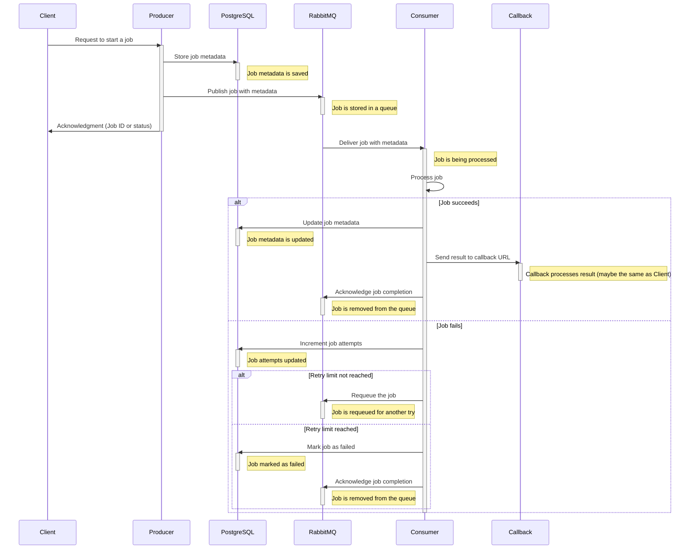

# poc-go-rabbitmq
This is a simple example of how to use RabbitMQ with Go.


> PostgreSQL is used to store the job metadata. (but not implemented yet)

## Prerequisites
- Docker
- Go v1.20

## Getting Started
1. Clone this repository
2. Run the following command to start the all services
```bash
docker compose up -d --build --scale go-consumer=3
```
3. Call the following endpoint to send a message to the queue
```bash
# Start a long-running task
curl --location --request POST 'http://localhost:3099/start-task'

# Get the status of the task (you can use the id from the previous command)
curl --location 'http://localhost:3099/jobs/:id'

# Retry the task (you can use the id from the previous command)
curl --location --request POST 'http://localhost:3099/jobs/:id/retry'
```
4. See the message in the consumer logs
```bash
docker compose logs -f go-consumer
```
5. enjoy!